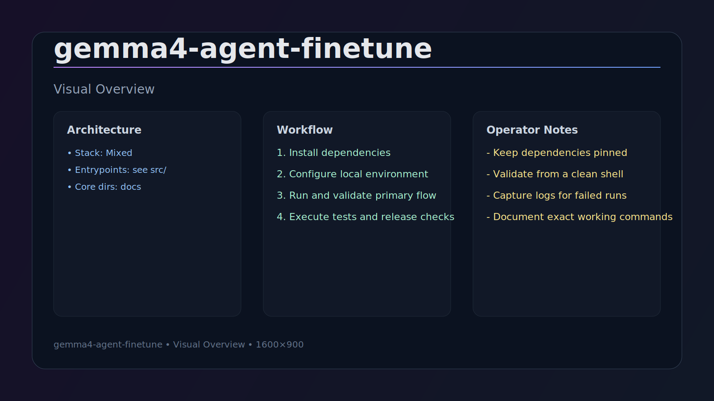

# Gemma-4 Agent Fine-Tuning

Training setup for fine-tuning Gemma-4-21B-A4B-IT-REAP with LoRA adapters for agent tasks.

## Presentation Framework (Proven README Pattern)

### TL;DR
Practical Gemma4 LoRA fine-tuning project with scripted run control and iterative trainer tuning.

### Why this project
- Solves a concrete workflow problem with reproducible command paths.
- Prioritizes operator reliability over demo-only output.
- Structured for practical use, not just conceptual documentation.

### Quick Start
```bash
./run_training.sh
```

### Installation
```bash
conda create -n gemma-h100 python=3.10 -y
conda activate gemma-h100
pip install -U pip
pip install unsloth transformers datasets trl peft accelerate wandb
```

### Usage Examples
```bash
chmod +x run_training.sh
./run_training.sh
python iterate_training_10x.py
```

### Architecture at a glance
- run_training.sh — operational launcher
- fine_tune_blackwell.py — training logic
- TRAINING_STATUS.md / TRAINING_SCRIPT_SUMMARY.md — run history and tuning decisions

### Troubleshooting
- If conda activation fails in non-interactive shell, source conda profile first.
- If OOM occurs, lower effective batch size before model changes.

### Project status
Continue loss/stability improvements with controlled iterative sweeps.


## Installation

```bash
# Example: conda env used by project scripts
conda create -n gemma-h100 python=3.10 -y
conda activate gemma-h100
pip install -U pip
pip install unsloth transformers datasets trl peft accelerate wandb
```

## Quick Start

```bash
chmod +x run_training.sh
./run_training.sh
```

## Usage Examples

- Run scripted training session with logging
```bash
./run_training.sh
```

- Direct training invocation (from script)
```bash
python fine_tune_blackwell.py 2>&1 | tee training_$(date +%Y%m%d_%H%M%S).log
```

- Iterative tuning helper
```bash
python iterate_training_10x.py
```

## Implementation Overview

- `run_training.sh` is the operational entrypoint (env activation, WANDB setup, launch).
- `fine_tune_blackwell.py` (invoked by script) performs LoRA/finetune run logic.
- `iterate_training_10x.py` and `fix_trainer.py` support iterative stabilization.
- `TRAINING_STATUS.md` and `TRAINING_SCRIPT_SUMMARY.md` document training state and decisions.

## Troubleshooting

- If CUDA/OOM occurs, lower batch size and grad accumulation before changing model family.
- If WANDB logging fails, verify auth and set `WANDB_PROJECT`/`WANDB_RUN_NAME` explicitly.
- If conda activation fails in non-interactive shells, source the conda profile script first.

## Visual Overview




## Overview

**Model:** Gemma-4-21B-A4B-IT-REAP (21.4B parameters, MoE with 103 experts)
**Method:** LoRA fine-tuning (29.6M trainable parameters, 0.14%)
**Hardware:** H100 GPU
**Framework:** Unsloth with 4-bit quantization

## Current Best Configuration

```python
# Optimized per Unsloth Gemma-4 best practices
LORA_R = 16
LORA_ALPHA = 32          # 2x rank (recommended for 21B models)
LORA_DROPOUT = 0
MAX_GRAD_NORM = 1.0     # Gradient clipping
WARMUP_RATIO = 0.03    # Adaptive warmup (3%)
LEARNING_RATE = 2e-4
MAX_STEPS = 500
```

## Performance

| Iteration | Loss | Perplexity | Config |
|-----------|------|------------|--------|
| 3 | 2.858 | 17.43 | alpha=16 (baseline) |
| **4** | **2.655** | **14.22** | **alpha=32** ✨ |
| 5 | 2.655 | 14.22 | alpha=32 |

**Improvement from alpha=32:** 7.1% loss reduction, 18.4% perplexity reduction

## Files

### Training Scripts
- `fine_tune_blackwell.py` - Main training script with Unsloth
- `iterate_resume.py` - Resume training from last iteration
- `synthetic_data_generator.py` - Generate training examples

### Workflow Scripts
- `run_training.sh` - Start training
- `cleanup.sh` - Quick disk cleanup
- `aggressive_cleanup.sh` - Full cleanup (5GB+ recovery)
- `cleanup_report.sh` - Check disk usage

### Analysis Scripts
- `benchmark_model.py` - Evaluate model performance
- `evaluate_finetuned.py` - Test fine-tuned model

## Key Improvements

1. **LoRA Alpha**: 16 → 32 (Unsloth recommendation)
2. **Warmup**: Fixed 50 steps → 0.03 ratio (adaptive)
3. **Gradient Clipping**: None → 1.0 (stability)
4. **Validation**: 50 → 100 samples (reliability)

## Dataset

- **Base**: 3,995 agent task samples
- **Augmented**: ~6,000 samples with synthetic examples
- **Growth**: ~5% per iteration

## Training Progress

- **Completed**: Iterations 1-5 (50% of 10x workflow)
- **Current**: Iteration 6 in progress
- **Best Model**: Iteration 4/5 (loss: 2.655)


## Requirements

- Unsloth: `pip install "unsloth[colab-new]"`
- PyTorch 2.10+ with CUDA support
- H100 GPU (80GB VRAM minimum)

## Notes

- Model: 0xSero/gemma-4-21b-a4b-it-REAP
- Quantization: 4-bit (QLoRA)
- Training time: ~34 minutes per iteration
- Disk space: Keep at least 7GB free

## References

- [Unsloth Gemma-4 Documentation](https://www.unsloth.ai/docs/models/gemma-4/train)
- [D-Flash Analysis](dflash_analysis.md)
- [Autoresearch Findings](autoresearch_findings.md)

---

*Training in progress - Iteration 6/10*

## Contributing

Contributions are welcome. Open an issue first for significant changes, then submit a focused PR with reproducible validation steps.

## License

License details are documented in this repository.
